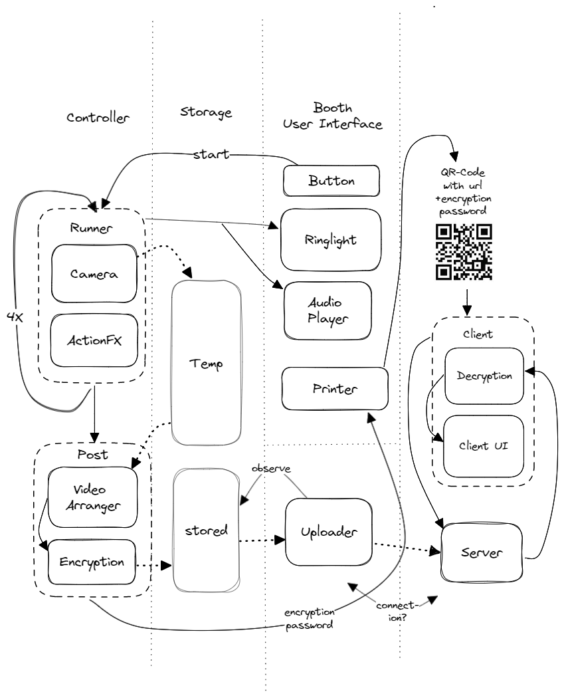
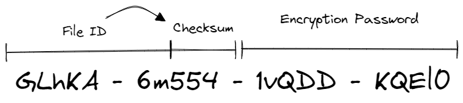

# Raspibooth
An innovative photobooth solution powered by Raspberry Pi, capturing moments as short videos with unexpected interactive elements. Comprises a Python-based booth controller and a Deno runtime server for API and web app access.
>🚧 Note: This project is in its early stages and under active development. Contributions and feedback are welcome!


## 🚀 Development Status

### 🎯 **Milestone 1**

- ✅ **Camera Integration:** Utilize `picamera` for video recording.
- ✅ **Lighting:** Implement `ws281x` ringlight for status indication and flash functionality.
- ✅ **Start Mechanism:** Integrate a hardware start button.
- 🟡 **Printing:** Integrate a simple thermal printer for QR code and/or token printing.
- ✅ **Server API:** Develop a basic server API with an authentication mechanism.
- ✅ **Client Web App:** Create a web application for viewing videos.
- ✅ **Security:** Implement AES-256 end-to-end encryption.
- ✅ **URL Generation:** Create URLs with `fileId` and encryption password.
- ✅ **Alternative Access:** Implement access tokens.
- ✅ **File Validation:** Use `fileId` checksum for browser validation.
- ✅ **Timeline Configuration:** Allow programmable timelines using YAML files.
- 🟡 **Configuration**: Introduce configuration files for customizable settings and preferences.
- 🟡 **Uploader**: Implement a mechanism to upload encrypted photos/videos.
- 🟡 **Performance:** Implement multithreading.
- 🟡 **Notifications:** Add email subscription for upload notifications.
- 🟡 **Credential Storage:** Option to save credentials in `localStorage`.
- 🟡 **Prototype:** Design and build a compact, wall-mounted prototype.
- 🟡 **Setup:** Develop a script for configuring the Python project under various conditions.
- 🟡 **Real-world Testing:** Test the booth at a party.

### 🎯 **Milestone 2**

- 🟡 **Light & Action Control:** Integrate DMX for controlling lights and interactive elements.
- 🟡 **Custom DMX Devices:** Design and build custom, simple DMX devices.
- 🟡 **Audio:** Implement multi-channel audio output.
- 🟡 **Session Concepts:** Draft concepts for "action photo sessions".
- 🟡 **Audio Production:** Record and produce session audio.
- 🟡 **Browser Notifications:** Implement browser notifications for upload alerts.
- 🟡 **Full-scale Prototype:** Design and construct an actual photobooth prototype.
- 🟡 **Party Time:** Showcase the booth at another party!


## 🛠 Installation Instructions

RaspiBooth is structured into two core components, each tailored with a distinct role and technology stack.

### 📋 Prerequisites

- **Rust Compiler:** Essential for compiling the `cryptography` Python library on the Raspberry Pi.
- **Deno Runtime:** Required for running the server.

### 🖥 Hardware Requirements

While development can proceed with mocked versions of the hardware, actual usage and testing demand the following components:

- **PiCamera:** For capturing moments.
- **Serial Thermal Printer:** For QR code/token printing.
- **GPIO Button:** Acts as a start button when connected to the Raspberry Pi.
- **WS2812B Ringlight:** Serves as both a status indicator and flash.

### 🚀 Setup

#### Booth:

1. **Dependencies:** Install the necessary dependencies based on your platform and hardware:
   - PiCamera: [Installation Instructions](#) *(Link to be added)*
   - RPi.GPIO Library
   - Serial Thermal Printer: Use the `escpos` Python library.
   - WS2812B Ringlight: Use the `rpi_ws281x` Python library.

2. **Initialization Script:** Running `bash setup.sh` will:
   - Set up a virtual environment.
   - Configure Python paths.
   - Generate a config file at the project root.
   - Make helper scripts executable.

3. **Cryptography Library:** Occasionally, the setup script might encounter issues with the cryptography library. Ensure `pip` is updated and the `rustc` compiler is correctly installed. If issues persist, manually run `pip install cryptography`. [Cryptography Installation Docs](#) *(Link to be added)*

#### Server:

The server is designed to be plug-and-play and should run without additional configurations.

#### 🛠 Configuration

A configuration file, `booth.config.yaml`, is located at the project root. Further details on this will be provided soon.

#### 🏃 Running and Testing the Project

The helper script, `./task.sh`, streamlines various tasks:

```
Usage: ./task.sh [option] [optional file]
Options:
  server_test    - Run server tests.
  server_start   - Initiate Deno runtime.
  booth_test     - Execute booth tests.
  optional file  - Specify a file for testing (applicable for server_test and booth_test).
```

#### ❗ Troubleshooting

Details on common issues and their resolutions will be added soon.


## 📚 Technical Description

### 🏗 Architecture Overview


RaspiBooth operates on a unique mechanism:

- Each photo session generates 4 distinct images/videos. These sessions are orchestrated by timeline files with specific events, including the trigger for capturing photos.
- Upon completion of a session, the 4 files are consolidated, zipped with relevant metadata, and encrypted.
- Users receive a printed output containing the file ID and password.
- The encrypted archive is subsequently uploaded to the server by the uploader.
- On the client-side, the software retrieves the file using the file ID and decrypts it with the provided password.

### 🔒 Security

- **Encryption:** All files undergo AES-256 GCM encryption, ensuring data integrity and confidentiality.
- **File ID & Password:** Both are generated as random strings containing characters from A-Z, a-z, and 0-9. Their lengths are configurable, with a default of 10 characters each. For enhanced security, their lengths can be extended.
- **Key Derivation:** The password undergoes transformation into a 32-bit encryption key using PBKDF2HMAC. *(Please verify the exact name)*

#### Access URL

- The user's access URL is a composite of the file ID and password: `[host]/[file ID]#[password]`.
- By positioning the password after a `#`, it remains confined to the browser and is never transmitted to the server.

#### Access Token

As an alternative to the URL, an access token can be used. This token is a combination of the file ID and password, segmented differently. 


### 🛡 Authentication Mechanisms

To prevent unauthorized uploads and potential server spamming, the uploader employs a straightforward authentication method. It transmits an API key via the header, which the server must recognize.

### 📸 Photo Sessions

Upon pressing the start button, the photo session commences. The entire process culminates with the printer producing a QR code, which users can scan to access their captured moments.

### 🎭 Unexpected Interactive Elements

These elements, designed to add a touch of surprise and fun to the photo sessions, will be incorporated in future versions of RaspiBooth.

### 📤 Uploader

The uploader plays a pivotal role in the RaspiBooth ecosystem. After the encryption of photos/videos, the uploader is responsible for securely transmitting the encrypted archive to the server. This ensures that users' memories are safely stored and ready for retrieval.

### ⚙ Configuration

*More details about the configuration files and their structure will be provided soon. This section is currently under development.*

### 🌟 Additional Features

*Further technical features and enhancements, such as multithreading and notifications, will be discussed in this section. Details are forthcoming.*


## 🧪 Testing

RaspiBooth is equipped with a comprehensive testing suite to ensure its robustness and reliability. Both the booth and server components have their dedicated testing mechanisms.

### Testing Frameworks

- **Booth:** Utilizes the `unittest` framework for Python.
- **Server:** Leverages `Deno.test` for the Deno codebase.

### Running Tests

- **Booth:** Execute `./task.sh booth_test` to run the booth tests.
- **Server:** Use `./task.sh server_test` to initiate server tests.

### VSCode Integration

For a seamless testing experience within VSCode, it's recommended to use the [Test Explorer UI](https://marketplace.visualstudio.com/items?itemName=hbenl.vscode-test-explorer) extension. This tool provides an interactive interface, making it easier to run, debug, and visualize tests.

### CLI for Testing

To further enhance the testing process, a custom CLI (Command-Line Interface) has been developed. This CLI offers a menu-driven approach to perform various testing-related tasks.

Run `./helpercli.sh` to start the CLI.

#### Using the CLI

1. **Select a Category:** Upon launching the CLI, you'll be prompted to choose a category. These categories group related testing functions.
2. **Choose a Function:** After selecting a category, you'll be presented with a list of functions within that category.
3. **Provide Arguments:** Some functions require arguments. You can either use default values or provide custom inputs.
4. **Execute & View Results:** The chosen function will run, and you'll be presented with the results.

#### CLI Features

The CLI is equipped with a range of functions, organized into categories. Here's a brief overview:

- **Test Data Generation:** Functions to generate random access tokens, access tokens from files, and test links from files.
- **Test File Generation:** Tools to save random strings with checksums, create single-color videos, generate encrypted archives, and more.
- **Input Hardware:** Functions related to hardware input, such as recording raw test videos with PiCamera.

The CLI is powered by a JSON configuration (`menu.json`) that defines the menu structure, and a Python script that drives the CLI's functionality. This modular approach ensures easy extensibility and maintenance.


## 📜 License

RaspiBooth is licensed under the [GNU General Public License v3.0](https://www.gnu.org/licenses/gpl-3.0.html).

This license ensures that the software remains free and open-source, and any adaptations or derivatives of this project must also be released under the same license. For more details, please refer to the [license document](https://www.gnu.org/licenses/gpl-3.0.html).
